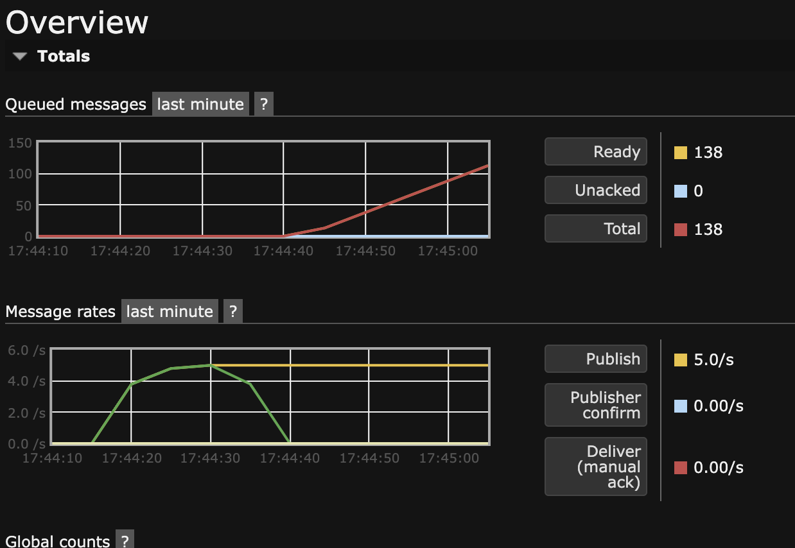

## queues/lesson1

Реализован паттерн производитель - потребитель при помощи RabbitMQ

``` docker compose up``` - запуск producer, consumer и rabbitmq

производителей запускается 5 реплик
потребителей запускается 2 реплики

``` docker compose stop consumer``` - останавливает потребитель, очередь начинает расти 
это можно посмотреть в админке http://localhost:15672/

доступ в админку:
```
user: user
password: 123456
```

