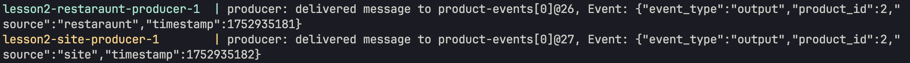
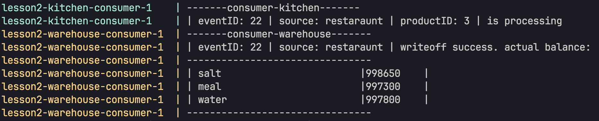
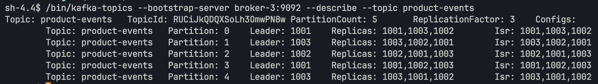
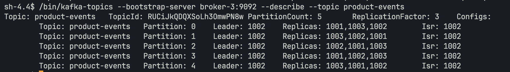
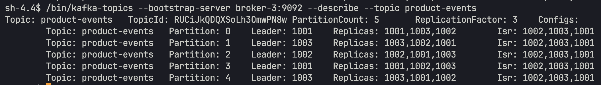

#
Описание: cистема для заказа продуктов, которые нужно приготовить из ингредиентов,хранящихся на складе.
#
Бизнес-логика: пользователь заказывает продукт в ресторане или на сайте -> 
отправляется событие о выпуске продукта (output), кухня и склад обрабатывают это событие: 
- склад списывает у себя из баланса необходимые для выпуска продукта ингредиенты
- кухня принимает заказ и начинает его готовить

#

1. Поднимаем кластер брокеров командой:
```docker compose up broker-1 broker-2 broker-3 zookeeper init-kafka -d```

    В логах видим, что создался топик:

    

2. Запускаем консьюмеры командой:
     ```docker compose up warehouse-consumer kitchen-consumer```

3. Запускаем продюсеры командой:
    ```docker compose up restaraunt-producer site-producer```

    в логах видим сообщение, что оба продюсера отправляют сообщения
    

    в логах консьюмера склада и кухни видим, что происходят списания в соответствии с выпущенным продуктом
    


    Проверим как распределены партиции когда все узлы работают в кластере:
    


4. Останавливаем broker-1, видим, что произошла перебалансировка партиций между брокерами,
но продюсеры и консьюмеры продолжают работать без перебоев. После этого останавливаем broker-2, снова происходит перебалансировка, но на работе продюсеров и консьюмеров это тоже никак не отражается.

    


5. Запускаем broker-1, broker-2 обратно в работу. Происходит перебалансировка партиций между всеми узлами кластера, через 10 секунд, поскольку в конфигах брокеров указаны значения:
    ```
    KAFKA_AUTO_LEADER_REBALANCE_ENABLE: "true"
    KAFKA_LEADER_IMBALANCE_CHECK_INTERVAL_SECONDS: 10
    ```
    


