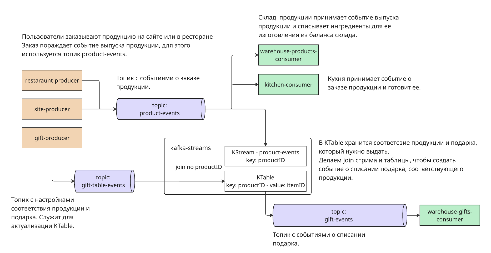
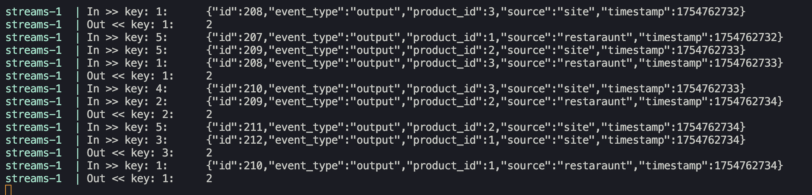
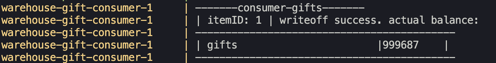
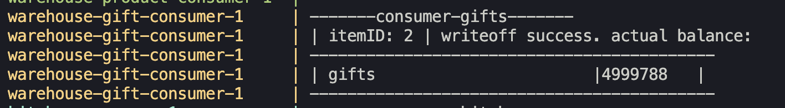

#
Описание: cистема для заказа продуктов, которые нужно приготовить из ингредиентов,хранящихся на складе.
#
Бизнес-логика: пользователь заказывает продукт в ресторане или на сайте -> 
отправляется событие о выпуске продукта (product-event), кухня и склад обрабатывают это событие: 
- склад списывает у себя из баланса необходимые для выпуска продукта ингредиенты
- кухня принимает заказ и начинает его готовить
- есть продукция при заказе которой покупателю полагается подарок. Подарок - это готовая вещь которую не нужно готовить. Его нужно только списать и вычесть из баланса на складе.

#

Общая схема:
    

0. Выполняем ```docker compose build```

1. Поднимаем кластер брокеров командой:

```docker compose up broker-1 broker-2 broker-3 zookeeper init-kafka -d```

2. Запускаем консьюмеры командой:
     ```docker compose up warehouse-product-consumer kitchen-consumer warehouse-gift-consumer```
     в этом уроке добавился ```warehouse-gift-consumer```, он отвечает за списание подарков со склада, он читает топик с результатом джойна KTable (который хранит соответствие продукции и подарка) и KStream (который читает событие заказа продукции).

3. Запускаем продюсеры командой:
    ```docker compose up restaraunt-producer site-producer gift-producer```.
    В этом уроке добавился ```gift-producer```, он пишет в топик который читает KTable и актуализирует значения в таблице соответствия продукции и подарка.

4. Запускаем kafka-streams командой:
    ```docker compose up streams```.
    В директории ```streams/app``` находится java-приложение с KStream и Ktable
    ```KStream``` читает топик ```product-events``` где находятся события о заказе продукции. Ключом в KStream является ```ProductID```.
    ```KTable``` читает топик ```gift-table-events``` где находятся события о настройке какой подарок соответствует продукции.
    Key: ```productID``` (id продукции), Value: ```itemID``` (id подарка).

    Сделан джойн между ними, чтобы найти соответствие продукции и подарка и сделан produce события в топик ```gift-events``` о списании соответствующего ```itemID```, подарка со склада.

После запуска видим, что 
в результате получения в ```KStream``` события о заказе продукции, с ключом ```ProductID```, для которого есть соответствующая запись в ```KTable```, продюсится сообщение с ключом ```ProductID``` (id заказанной продукции) и значением ```ItemID``` (id подарка).



 Видим, что эти сообщения принимает консьюмер списания подарков со склада:


-


Таким образом при помощи KStream и KTable и их джойна, получилось создать отдельный топик, где объеденены нужные для бизнес-логики данные.
