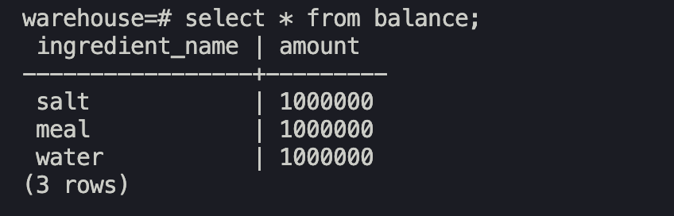
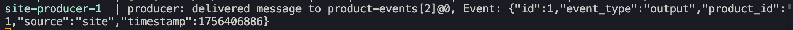

#
Описание: cистема для заказа продуктов, которые нужно приготовить из ингредиентов,хранящихся на складе.
#
Бизнес-логика: пользователь заказывает продукт на сайте -> 
отправляется событие о выпуске продукта (product-event), склад обрабатывает это событие: 
- склад списывает у себя из баланса необходимые для выпуска продукта ингредиенты
#

Общая схема:
    

0. Выполняем ```docker compose build```

1. Поднимаем кластер брокеров командой:
```docker compose up broker-1 broker-2 broker-3 zookeeper init-kafka -d```

2. Запускаем базы данных для сервисов ```site``` и ```warehouse```
```docker compose up db-site db-warehouse``` 

3. Запускаем продюсер командой:
```docker compose up site-producer```
```site-producer``` - принимает по http запросы на создание заказа определенной продукции
создание заказа фиксирует в таблице orders и outbox для отправки события создания заказа в kafka

4. Запускаем консьюмер командой:
```docker compose up warehouse-consumer```
```warehouse-consumer``` читает из kafka событие создания заказа и списывает с баланса ингредиенты для приготовления продукции.
 
5. 
Проверим баланс на складе в таблице ```balance```
при новых заказах с сайта ожидаем, что баланс ингредиентов будет уменьшаться в соответствии с рецептурой заказываемой продукции.

Проверим начальный баланс ингредиентов на складе:



Отправляем запрос к сервису site о новом заказе:
```curl -X POST -H "Content-Type: application/json" -d '{"product_id": 1}' http://127.0.0.1:8080/order```


проверяем таблицу ```orders``` видим, что сервис ```site``` зарегистрировал новый заказ:


проверяем таблицу ```outbox``` видим, что сервис ```site``` зарегистрировал новую задачу на отправку сообщения в kafka и есть отметка об отправке ```processed_at```


по логам сервиса ```site``` видим, что произошла публикация в kafka топик ```product-events```


Таким образом producer на стороне сайта взял задачу из таблицы ```outbox``` и опубликовал ее в топик ```product-events```.


Проверим таблицу ```transactions``` в сервисе-потребителе и видим, что консьюмер сервиса ```warehouse``` получил событие из kafka и зарегистрировал его.


проверим таблицу ```balance``` и видим, что баланс ингредиентов уменьшился.


В случае, если сообщение о заказе задублировалось (например, запрос обновления таблицы ```outbox``` в сервисе ```site``` завершился с ошибокой а сообщение было отправлено в kafka, что вызвало retry отправки), то при помощи проверки, была ли уже транзакция с таким же transactions_id (id заказа) определим, нужно ли обрабатывать списания из баланса еще раз:

```go
// если записей по этому eventID нет (будет ошибка sql.ErrNoRows), значит событие ранее не обрабатывалось
// нужно его обработать
err = db.QueryRow("SELECT 1 FROM transactions WHERE transaction_id = $1", event.ID).Scan()
if err != nil && !errors.Is(err, sql.ErrNoRows) {
    fmt.Println("inbox error:", err)
    return
}

// если ошибки sql.ErrNoRows нет, значит такую транзакцию мы уже обрабатывали, коммитим оффсет и выходим
if err == nil {
    consumer.CommitMessage(msg)
    fmt.Printf("duplicated message: event %d is already processed", event.ID)
    return
}
```

Таким образом при помощи таблицы ```transactions``` реализована дедупликация сообщений из kafka.

